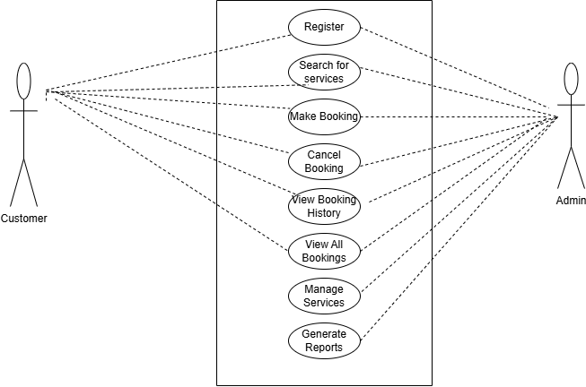

# Requirement Analysis in Software Development

This repository collects notes, templates, and best practices around **requirement analysis**—the process of gathering, analyzing, documenting, and validating what a software project must do. Here you’ll find:

- **Key activities in Requirement Analysis**
. Requirement Gathering
. Requirement Elicitation
. Requirement Documentation
. Requirement Analysis and Modeling
. Requirement Validation
- **Types of Requirement Analysis:**
. Functional & Non-functional Requirements  
- **Use Case Diagrams & Acceptance Criteria**

## What is Requirement Analysis?

Requirement Analysis is a critical phase in the software development lifecycle (SDLC) where the project team gathers, analyzes, and defines the requirements of the software product to be developed.
Requirement analysis is important because it is a foundational phase in the Software Development Lifecycle (SDLC). It ensures that development efforts are focused on solving the right problems, for the right users, in the right way.

### Why is Requirement Analysis Important?

Requirement analysis plays a vital role in the Software Development Lifecycle (SDLC). It ensures that the development process is guided by clear, complete, and agreed-upon objectives. Below are three key reasons why this phase is critical in (SDLC):

### 1. Ensures Project Clarity and Alignment

Requirement analysis defines what the software should do, who it's for, and the problems it solves. This clarity helps:

- Developers understand what to build
- Stakeholders align on expectations
- The team stay focused on business goals

### 2. Reduces Costly Errors and Rework

Identifying and resolving issues during the requirement phase is far more cost-effective than fixing them later. Thorough analysis prevents:

- Miscommunication
- Unnecessary features
- Expensive last-minute changes

### 3. Provides a Foundation for Testing and Validation

Requirements serve as the baseline for test planning. They allow the QA team to:

- Verify that features meet expectations
- Ensure no requirement is overlooked
- Build test cases directly linked to user needs

#### Key Activities in Requirement Analysis

The requirement analysis phase includes several important activities that ensure the software being developed meets user and business needs. Below are the five core activities and what each involves:

### 1. Requirement Gathering

- Involves collecting information from stakeholders (clients, users, managers) about their needs and expectations.
- Focuses on identifying high-level business goals and user requirements.
- Common methods: interviews, surveys, questionnaires, brainstorming sessions.

### 2. Requirement Elicitation

- It involves drawing out hidden, implied, or unclear requirements.
- Helps uncover real needs that users may not express directly.
- Techniques include observation, use case development, workshops, and prototyping.

### 3. Requirement Documentation

- Involves organizing the gathered and elicited information into a formal document.
- Ensures that requirements are clearly written, traceable, and understandable to all stakeholders.
- Common artifacts: Software Requirement Specification (SRS), user stories, use case diagrams.

### 4. Requirement Analysis and Modeling

- Focuses on examining and refining the documented requirements for completeness, consistency, and feasibility.
- May include modeling using diagrams (e.g., flowcharts, UML diagrams) to visualize system behavior.
- Helps identify conflicting, duplicate, or vague requirements before development begins.

### 5. Requirement Validation

- Ensures that all requirements are correct, complete, and agreed upon by all stakeholders.
- Confirms that documented requirements truly reflect user needs.
- Techniques include reviews, walkthroughs, inspections, and formal approval processes.

## Types of Requirements

### Functional Requirements

These are the core features and actions the booking system must support.

- User registration and login
- Service search and filtering
- Create/view/cancel bookings
- Admin: manage availability
- Auto email confirmations
- Booking history/reporting

### Non-Functional Requirements

These define performance and quality standards the system must meet.

- Fast load times (≤ 2s per page)
- High availability (99.9%)
- Secure data handling (encryption)
- Responsive across devices
- Scalable for 500+ users
- Accessible UI (WCAG compliant)

## Use Case Diagrams

Use Case Diagrams are a type of Unified Modeling Language (UML) diagram used to visually represent the interactions between users (actors) and a system. They show what the system does (not how), focusing on the functional requirements from the user's perspective.

### Benefits of Use Case Diagrams

1; Clear Understanding of System Scope

- Helps stakeholders visualize what functionality will (and won’t) be included.

- Defines system boundaries early in the development process.

2; Improved Communication

- Provides a common visual language that both technical and non-technical team members can understand.
- Reduces misunderstandings between developers, clients, and users.

3; Helps Identify Functional Requirements

- Each use case corresponds directly to a functional requirement.
- Acts as a checklist during requirement validation and implementation.

4; Simplifies Test Case Creation

- Helps testers understand the different ways users interact with the system.
- Can guide the creation of user-centric test scenarios.

5; Supports Better Design

- By knowing how users interact with the system, developers can structure the backend and UI more effectively.

## Acceptance Criteria

Importance of Acceptance Criteria in Requirement Analysis
Acceptance Criteria are predefined conditions that a software feature or requirement must meet to be accepted by the end-user, stakeholder, or product owner. They act as a bridge between requirement analysis and validation, ensuring clarity and shared understanding.

Here's Why It Matters:

1. Define Done Clearly

- They specify when a feature is complete and ready for delivery.
- Prevents ambiguity by setting measurable expectations for each requirement.

2; Align Stakeholders and Developers

- Ensures that business needs are accurately translated into technical deliverables.
- Helps teams agree on what success looks like for each feature.

3; Improve Communication

- Simplifies discussions between product owners, designers, developers, and testers.
- Serves as a contract of understanding between clients and the development team.

4; Guide Development and Testing

- Developers use acceptance criteria to implement features correctly.
- QA teams use them to create test cases and verify functionality against expected behavior.

5; Reduce Rework and Scope Creep

- Well-written criteria minimize the risk of misunderstanding requirements.
- Keeps the team focused on delivering exactly what was requested, nothing more, nothing less.

📝 Example (Booking System):
User Story: As a customer, I want to book a hotel room so I can reserve accommodation in advance.
Acceptance Criteria:

- Booking must not proceed without selecting a valid date range.
- The system must display a confirmation message after booking.
- A confirmation email should be sent automatically to the customer.

### Example (Checkout feature in a Booking System)

User Story:
As a customer, I want to securely complete the checkout process after selecting a service or booking, so I can confirm and pay for my reservation.

### The Acceptance Criteria

**Payment Option Displayed**
. The system must display available payment methods (e.g., credit/debit card, PayPal)during checkout.

**Booking Summary Visible**
. The user must see a clear summary of the booking, including service name, date, time, duration, and total price.

**Required Fields Validation**
. The system must not proceed to payment unless all mandatory fields (e.g., billing info, contact details) are filled in correctly.

**Secure Payment Processing**
. Payment details must be submitted over a secure (HTTPS) connection and handled by a trusted payment gateway.

**Confirmation of Payment**
. After a successful payment, the user must see a confirmation message or screen.

**Email Confirmation Sent**
. A confirmation email containing the booking details and receipt must be sent automatically to the user’s registered email.

**Error Handling**
. If payment fails, an appropriate error message must be displayed, and the user must have the option to retry.
